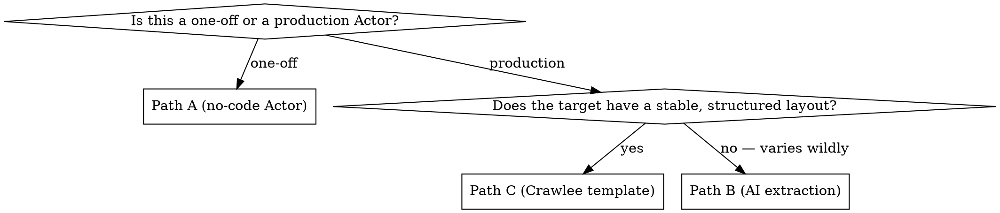

# Apify Scraper Builder

Build a scraper Actor on Apify — from configuring an existing no-code scraper to coding a full Crawlee-based crawler. This skill is the **code-first entry point** that orchestrates the canonical 3-paths decision. The cross-cutting scraping doctrine (anti-bot strategy, tool ladder, error taxonomy) is a separate concern; this skill is "given I've already decided WHAT to scrape, how do I scaffold the Actor?"

## Core insight: three creation paths

Like for MCP servers, most people walk in thinking they should write everything from scratch with Crawlee. **In about 60% of cases, a no-code scraper Actor or an LLM-extraction Actor is the right answer.** Pick the path *before* writing code — it changes everything downstream.

| Path | When | Starting point |
|---|---|---|
| **A — Configure a no-code scraper Actor** | One-off scrape, prototype, ad-hoc data pull. You configure URLs + a small `pageFunction` JS snippet via the Console. No `apify create`, no Docker, no git. | [`apify/web-scraper`](https://apify.com/apify/web-scraper) (Cheerio + browser JS eval), [`apify/cheerio-scraper`](https://apify.com/apify/cheerio-scraper) (pure HTTP), [`apify/puppeteer-scraper`](https://apify.com/apify/puppeteer-scraper), [`apify/playwright-scraper`](https://apify.com/apify/playwright-scraper) |
| **B — AI extraction** | Unstructured content (e.g. blog posts, articles, multi-vendor product pages with no consistent schema). You want the LLM to figure out what to extract instead of writing selectors. | [`apify/ai-web-scraper`](https://apify.com/apify/ai-web-scraper) (configure-only) or roll your own with Path C + an LLM call (`@anthropic-ai/sdk` / `openai`) |
| **C — Code from a Crawlee template** | Production scraper you'll own, maintain, monetize via PPE, and publish on the Store. Custom logic, anti-bot handling, multi-step flows. | `apify create my-scraper --template <name>` — see Path C decision tree below |

**The default for production scrapers is Path C.** Path A is for prototypes and ad-hoc one-shots. Path B is for sites where structural extraction is genuinely impossible (rare — usually the right answer is Path C with a small AI-extraction step, not a fully AI-driven scraper).

## Decision flow



Before going further, you MUST have completed the diagnostic phase (diagnose the target) — at minimum knowing the target's anti-bot vendor, JS-rendering needs, and whether an internal JSON API exists. **Nine times out of ten an internal JSON API exists** (inspect the DevTools Network panel); finding it eliminates Path B/C complexity entirely and turns the work into a `got-scraping` + Cheerio script.

## Path C — Crawlee template sub-decision

Path C has its own decision tree because Apify ships five distinct scraping templates. Picking the wrong one means either over-paying for browser compute (using Playwright for static HTML) or under-resourcing for anti-bot (using Cheerio against Cloudflare).

| Template | When | Memory | Cold start |
|---|---|---|---|
| `ts-crawlee-cheerio` | Static HTML, no JS challenge, low-to-moderate rate limiting | 256–512 MB | < 2 s |
| `ts-crawlee-puppeteer-chrome` | JS-rendered SPAs, basic anti-bot. Legacy choice — prefer Playwright. | 1–2 GB | 5–10 s |
| `ts-crawlee-playwright-chrome` | JS-rendered SPAs, moderate anti-bot (Cloudflare basic, DataDome) | 2–4 GB | 5–10 s |
| `ts-crawlee-playwright-camoufox` | Hard targets (Cloudflare Enterprise, HUMAN/PerimeterX, Akamai stealth) | 2–4 GB | 8–15 s |
| `ts-empty` / `ts-start` | Custom architecture not fitting any of the above (multi-Actor suites, hybrid HTTP+browser, AI-extraction Actors) | varies | varies |

The full tool-ladder reasoning (with cost-per-result, IP-economics, escalation triggers) belongs to your scraping anti-bot doctrine. Consult it before picking when you're not sure.

Python equivalents exist for all of these (`python-crawlee-beautifulsoup`, `python-crawlee-playwright`, `python-crawlee-playwright-camoufox`). Python scraper Actors are the exception on Apify — about 90% of production scrapers in the Store are Node. Default to Node unless you have a strong reason (existing Python team, Scrapy migration, specific Python ML libraries in the extraction pipeline).

## The five things every scraper Actor must get right

These apply across all three paths. Memorize them.

### 1. Diagnose before coding

```
Q: Does the site have an internal JSON API I can hit instead of scraping HTML?
A: 90% yes. Spend 20 minutes in DevTools Network panel before touching Crawlee.
```

If yes, you don't need Path C at all — you need `got-scraping` + parsing. Hunt for the internal API in the DevTools Network panel first.

### 2. Always exit SUCCEEDED unless the platform crashed

Business-logic errors (target blocked, invalid input, selector failed, no results) → SUCCEEDED + structured error record in dataset. NEVER `Actor.fail()` for these. This single rule typically lifts an Actor from 50% success rate to 95%+ without changing scraping logic.

Treat the graceful-exit pattern and error taxonomy as non-optional doctrine.

### 3. PPE charge fires after success, never on retries

```ts
const item = await extract(page);
if (!validateItem(item)) return;        // don't charge for junk
await Actor.pushData(item, 'item-scraped');  // atomic shortcut: persist + charge
```

`Actor.pushData(data, 'event-name')` is the **preferred** charging pattern (atomic, no charged-but-not-pushed gap). For non-dataset events, use `await Actor.charge({ eventName: 'event-name' })` AFTER the work completes. Then check `eventChargeLimitReached` and stop enqueueing new work:

```ts
const charge = await Actor.charge({ eventName: 'item-scraped' });
if (charge.eventChargeLimitReached) {
  await crawler.autoscaledPool.abort();  // graceful — don't Actor.exit() mid-crawl
  return;
}
```

The full PPE-implementation and graceful-exit doctrine sits alongside this skill — consult your monetization and error-handling references.

### 4. Defensive selectors with fallbacks

Never depend on a single CSS selector for a critical field. Layered fallbacks survive A/B tests and minor redesigns:

```ts
const price = $('.price-current, [data-price], [itemprop="price"], .price')
  .first().text().trim() || null;
```

Prefer schema.org markup (`[itemprop="..."]`) over visual class names — it changes less often. The full selector strategy and schema validation belong to your scraping doctrine.

### 5. Cache external responses in the KV Store by default

Every external API response (third-party APIs, image fetches, anything you might re-fetch) goes through a KV Store cache with a 30-day TTL. The platform does not provide native TTL — it's code-managed via timestamps:

```ts
const cached = await store.getValue(key);
if (cached && Date.now() - cached.ts < 30 * 24 * 3600 * 1000) return cached.data;
const fresh = await fetcher();
await store.setValue(key, { data: fresh, ts: Date.now() });
return fresh;
```

Wrap this in a small helper and adopt a consistent key-naming convention for the KV Store cache.

## Path A — Configure a no-code scraper Actor

Use when: ad-hoc one-shot, prototype, or you want to validate the diagnostic phase before committing to code.

| Apify Actor | When |
|---|---|
| `apify/cheerio-scraper` | Static HTML, fastest. Default pick. |
| `apify/web-scraper` | JS-rendered pages; runs your `pageFunction` inside a real browser context with jQuery available. |
| `apify/puppeteer-scraper` | When you need Puppeteer-specific browser control. |
| `apify/playwright-scraper` | Modern browser scraper; harder to block than Puppeteer. |

Workflow (no `apify create`, no Docker, no git):

1. Open the Actor's Apify Console page → "Try for free" → fill the input form.
2. Add start URLs (the category page URL).
3. Write a `pageFunction` in JS that extracts what you want and calls `await context.pushData({...})`. See `references/path-a-nocode.md` for templates.
4. Optionally set `pseudoUrls` or `linkSelector` for pagination.
5. Run. Inspect the dataset. Iterate.

**Limitations of Path A:**
- You don't own the Actor — you can't publish + monetize it.
- `pageFunction` is a JS string, hard to maintain in git.
- No TypeScript, no proper testing, no PPE billing on YOUR side (the Actor owner's PPE applies).

Path A is excellent for diagnosis ("does Cheerio work on this site?") before committing to Path C.

## Path B — AI extraction

Use when: the target's data shape varies wildly between pages and writing maintainable selectors is impossible. Genuine example: aggregating product info from 50+ different e-commerce sites with no common HTML schema.

**Two patterns:**

### Pattern B1 — Configure `apify/ai-web-scraper`

Use Apify's hosted AI-extraction Actor. No code required; you describe the data shape you want and the Actor uses an LLM to extract from each page. Best for one-off aggregation.

### Pattern B2 — Path C + LLM call

Roll your own. Crawlee fetches the page, you feed cleaned HTML/text to Claude or GPT, parse the JSON response. See `references/path-b-ai-extraction.md` for the full pattern + prompt template + cost considerations.

**Critical cost note:** Pattern B2 costs $0.001–$0.10 per page in LLM tokens alone. Path C with selectors costs ~$0.00001. **Only use AI extraction when selectors genuinely cannot work** — see the decision criteria in `references/path-b-ai-extraction.md`. The LLM-cost handling strategies (passing through vs absorbing LLM cost) covered in that reference apply here too.

## Path C — Code from a Crawlee template

The canonical production path.

```bash
apify create my-scraper --template ts-crawlee-cheerio
cd my-scraper
```

Or pick another template based on the sub-decision matrix above. The CLI's interactive picker (`apify create my-scraper` without `--template`) walks you through the choices.

> **AI-assisted scaffolding.** Each template ships an `AGENTS.md` at the project root that Claude Code / Cursor / Codex auto-read for context. To keep the assistant grounded in current platform facts while you build, add Apify's docs MCP (`claude mcp add apify "https://mcp.apify.com/?tools=docs" -t http`), and optionally the official skills (`npx skills add apify/agent-skills`). Full workflow and doc-feeding tricks: Apify's [Build Actors with AI](https://docs.apify.com/platform/actors/development/quick-start/build-with-ai) guide.

### What the template scaffolds

```
my-scraper/
├── .actor/
│   ├── actor.json
│   ├── input_schema.json
│   ├── dataset_schema.json
│   ├── output_schema.json
│   └── pay_per_event.json     # ADD this — not in default template
├── src/
│   ├── main.ts                 # Actor entry point
│   └── routes.ts               # Crawlee router (per-label handlers)
├── storage/                    # Local emulation (mirrors Apify Cloud)
│   ├── datasets/
│   ├── key_value_stores/
│   └── request_queues/
├── Dockerfile
├── package.json
├── tsconfig.json
└── .dockerignore
```

The default storage folder is `storage/` (newer Apify CLI versions; older versions used `apify_storage/`). Edit `storage/key_value_stores/default/INPUT.json` to set input for local `apify run`.

### Default `.actor/actor.json` (from template)

```json
{
  "actorSpecification": 1,
  "name": "my-scraper",
  "title": "My Scraper",
  "version": "0.0",
  "buildTag": "latest",
  "input": "./input_schema.json",
  "dockerfile": "./Dockerfile",
  "storages": {
    "dataset": "./dataset_schema.json"
  }
}
```

Add these fields for production:

```json
{
  "minMemoryMbytes": 256,
  "maxMemoryMbytes": 2048,
  "defaultRunOptions": {
    "build": "latest",
    "memoryMbytes": 512,
    "timeoutSecs": 3600
  },
  "categories": ["E_COMMERCE", "AUTOMATION"]
}
```

PPE is wired via `.actor/pay_per_event.json` (separate file):

```json
{
  "item-scraped": {
    "eventTitle": "Item scraped",
    "eventDescription": "Per successful product item committed to dataset.",
    "eventPriceUsd": 0.001
  }
}
```

The `pay_per_event.json` file lives at `.actor/pay_per_event.json` — not inside `actor.json`. Both file patterns have existed historically; the separate file is canonical in current Apify versions.

### Default `src/main.ts` skeleton (from `ts-crawlee-cheerio`)

```ts
import { CheerioCrawler } from '@crawlee/cheerio';
import { Actor } from 'apify';
import { router } from './routes.js';  // .js extension is REQUIRED — ESM project

await Actor.init();

const { startUrls, maxRequestsPerCrawl = 100 } = await Actor.getInput<Input>() ?? {};

const proxyConfiguration = await Actor.createProxyConfiguration({ checkAccess: true });

const crawler = new CheerioCrawler({
  proxyConfiguration,
  maxRequestsPerCrawl,
  useSessionPool: true,
  persistCookiesPerSession: true,
  maxRequestsPerMinute: 25,  // ~80% of target's known per-IP limit (here: 30 req/min → 24-25)
  requestHandlerTimeoutSecs: 60,  // bump to 120 for PlaywrightCrawler
  retryOnBlocked: true,      // Crawlee auto-rotates session on 403/429
  requestHandler: router,
});

await crawler.run(startUrls);
await Actor.exit();
```

Two things to never change in the template:
- **ESM imports use `.js` extension** even inside TypeScript files (e.g. `from './routes.js'`). This is the Node ESM contract and TypeScript respects it. Removing `.js` breaks the build.
- **`Actor.init()` and `Actor.exit()` bracket the run.** Don't skip them.

### Routes pattern (`src/routes.ts`)

```ts
import { createCheerioRouter } from '@crawlee/cheerio';
import { Actor } from 'apify';

export const router = createCheerioRouter();

router.addHandler('CATEGORY', async ({ request, $, enqueueLinks, log }) => {
  // Extract product cards on the current page
  const products = $('[data-testid="product-card"]').toArray().map((el) => {
    const $card = $(el);
    return {
      name: $card.find('h2, .product-name').first().text().trim() || null,
      price: parsePrice($card.find('.price, [itemprop="price"]').first().text()),
      url: new URL($card.find('a').attr('href') ?? '', request.url).href,
      imageUrl: $card.find('img').attr('src') ?? null,
      availability: $card.find('[itemprop="availability"]').attr('content') ?? null,
    };
  }).filter((p) => p.name && p.url);  // discard junk before charging

  for (const product of products) {
    const charge = await Actor.pushData(product, 'item-scraped');  // atomic charge+push
    if (charge.eventChargeLimitReached) {
      log.info('Charge cap reached — stopping enqueue.');
      return;  // do not enqueue the next page
    }
  }

  // Enqueue next page if pagination exists
  await enqueueLinks({
    selector: 'a.next-page, [rel="next"]',
    label: 'CATEGORY',
  });
});

// Default fallback if no label set
router.addDefaultHandler(async ({ request, log }) => {
  log.warning(`Unrouted request: ${request.url}`);
});
```

Full walkthrough (including `dataset_schema.json`, `input_schema.json` patterns, pagination strategies, KV Store state checkpoint, AI extraction inside a Crawlee route) in **`references/path-c-crawlee-templates.md`**.

## Local development loop

```bash
# Install dependencies
npm install

# Set input via local INPUT.json (Cloud storage is emulated under storage/)
cat > storage/key_value_stores/default/INPUT.json <<EOF
{ "startUrls": [{ "url": "https://example-shop.com/category/laptops" }], "maxProducts": 50 }
EOF

# Run locally
apify run --purge  # --purge wipes local storage from previous runs

# Inspect output
ls storage/datasets/default/    # JSON files = scraped items
cat storage/datasets/default/000000001.json
```

**Critical local-dev rules:**

1. **Never hit the live target from your local machine.** Tests use fixtures (saved HTML, scrubbed of PII). The first time you hit the real site is on Apify Cloud via `apify push` + a Cloud run.
2. **Mock `Actor.charge()`, `Actor.pushData()`, `Actor.openKeyValueStore()`** in tests. Charges are no-ops locally but should appear in logs.
3. **Vitest** is the canonical test runner. Run `npx vitest run` (no `--watch` in CI).

## Deployment & verification

```bash
apify login
apify push
```

Then in the Apify Console:

1. **Build** completes without warnings. Image size: < 500 MB for Cheerio, < 1.5 GB for Playwright.
2. **Test run** in the Console with the real category URL: completes SUCCEEDED, dataset populated, ≥ 95% of items have all required fields.
3. **Charged events** appear in the run's "Billing" tab — count matches dataset size × event price.
4. **Source-code hygiene — CRITICAL.** `apify push` uploads ALL git-tracked files, and `isSourceCodeHidden: true` only hides the Console UI — the public API (`apify actors info --json`) still exposes every `sourceFiles[]` (content included) to any authenticated user. For a **bundled** Actor (tsup/esbuild → `dist/main.js`), NEVER upload `src/` (the TypeScript = your algorithms/anti-bot logic), `tests/`, `*.map` (source maps reconstruct the TS from the bundle), or build configs — only `dist/main.js` + the runtime config the Dockerfile needs. `.gitignore` does NOT help (tracked files upload anyway); deploy from a **staging dir** that contains only an allowlist (e.g. a `.deploy-allowlist` consumed by a pre-push script). Internal notes and project history must be `.gitignored` too.
5. **Verify** — ⚠️ `jq` is often absent, so `… | jq … || echo ok` silently false-passes; extract names with Python. The latest `versions[0].sourceFiles[].name` must list ONLY `dist/main.js`, `README`, `CHANGELOG`, `package*.json`, `.actor/*`, `Dockerfile` — NEVER `src/*.ts`, `tests/`, `*.map`. Set `isSourceCodeHidden: true` and confirm in incognito the Source tab is gone. (Already-pushed builds keep their exposed source — fixing future pushes does not purge the past; delete/overwrite old versions if code already leaked.)
6. **Targets:**
   - Success rate ≥ 95% (else: the graceful-exit pattern is not implemented)
   - Per-page extraction rate ≥ 98% on the reference site
   - Memory plateau well under the configured cap

Full pre/post-deploy checklist in **`references/checklist-publish.md`**.

## Common mistakes

| Mistake | Symptom | Fix |
|---|---|---|
| Picking Playwright for a static HTML site | 4× higher memory, 10× cold start, no benefit | Use `ts-crawlee-cheerio` first; escalate only on observed JS-rendering failure |
| Removing `.js` extension from TS imports | Build error: "Cannot find module './routes'" | Keep the `.js` — ESM requires it in current Apify TS templates |
| Charging before `pushData` succeeds | Users charged on errors; refund requests | Use the atomic `Actor.pushData(data, 'event-name')` shortcut, OR put `Actor.charge` AFTER `pushData` |
| `Actor.fail()` for business errors (selector failed, target blocked) | Success rate drops to 50–70%, Store visibility tanks | Push structured error to dataset + `Actor.exit()` SUCCEEDED (graceful-exit pattern) |
| Hitting the live site from local machine during dev | Your home IP burned for reputation; risk of exposure | Use fixtures in `tests/fixtures/`; mock Crawlee/Apify; first live hit is on Apify Cloud |
| Hardcoded `maxConcurrency: 50` ignoring rate limits | 429 cascade; sessions retired faster than created | Set `maxRequestsPerMinute` for absolute rate; let autoscaling pick concurrency |
| Not handling `eventChargeLimitReached` | Free-plan users see infinite scraping but creator earns $0 | After every `Actor.charge` / `Actor.pushData(_, eventName)`, check the result and `await crawler.autoscaledPool.abort()` if cap reached |
| Hardcoded API tokens in `actor.json` | Tokens leak to Apify Store source files | Use Apify Console env vars (secret); `.gitignore` `.env` |
| No `requestHandlerTimeoutSecs` on slow sites | Requests stuck for minutes, autoscaling chokes | Set explicitly (60s for HTTP, 120s for browser) |
| Storing dataset items in KV Store instead of dataset | Dataset is empty in Console, KV has megabytes of orphan data | Push to dataset via `Actor.pushData`; KV is for state and config only |
| Mixing fast HTTP scraper with browser-rendered pages | Half the requests get junk HTML | Use `AdaptivePlaywrightCrawler` to switch per-request, or split into two Actors |

## Adjacent concerns (out of scope for this skill)

This skill owns scraper Actor **code & architecture**. These related topics each have their own body of doctrine that this skill assumes but does not duplicate:

- **Tool ladder, anti-bot strategy, diagnostic, hidden APIs, sessions, selectors, error taxonomy, testing fixtures, managed APIs (Firecrawl / ZenRows / ScrapFly)** — the cross-cutting scraping doctrine layer.
- **`Actor.charge()` correctness, PPE event taxonomy, free-plan handling, full PPE doctrine** — Apify monetization doctrine.
- **README + Store description + input/dataset/output schemas + creator bio** — Apify Actor content/SEO authoring.
- **Building an MCP server Actor instead of a scraper** — a distinct Actor type with its own template and Standby-mode patterns.
- **General Apify Actor patterns (Dockerfile choice, memory tiers, autoscaling, status messages, base images)** — platform-level Actor patterns.

## Reference files in this skill

- `references/path-a-nocode.md` — Configuring `apify/web-scraper`, `apify/cheerio-scraper`, `apify/puppeteer-scraper`, `apify/playwright-scraper`; pageFunction templates; pagination with `pseudoUrls`; when to graduate to Path C.
- `references/path-b-ai-extraction.md` — Pattern B1 (`apify/ai-web-scraper`) vs Pattern B2 (Crawlee + LLM); prompt templates; cost-per-page math; LLM-cost handling strategies (cross-ref to monetization).
- `references/path-c-crawlee-templates.md` — Full Path C walkthrough: project structure, input_schema, dataset_schema, routes pattern, pagination strategies, anti-bot escalation (DATACENTER → RESIDENTIAL → Camoufox), KV state checkpoints, AI extraction inside a route, mid-run graceful abort.
- `references/checklist-publish.md` — Pre-publish code review, local test, deploy, post-deploy verification, 7-day Insights checklist.

---

Part of the **[mr-bridge.com](https://mr-bridge.com)** toolkit for scraping, data, and content automation — see [Scrapers](https://mr-bridge.com/scrapers), [MCP servers](https://mr-bridge.com/mcp-servers), and [AI workflows](https://mr-bridge.com/ai-workflows).
